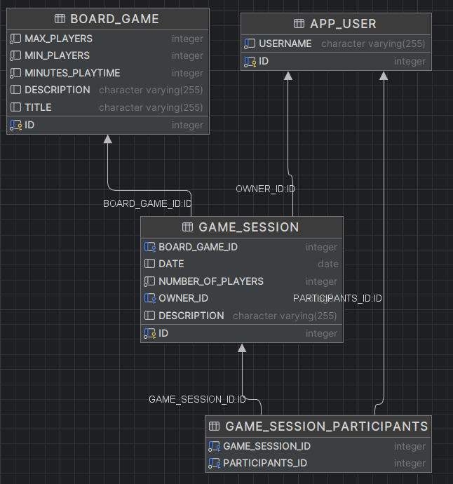
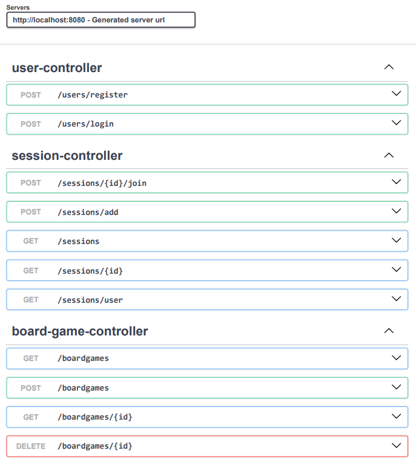
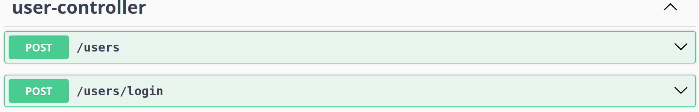
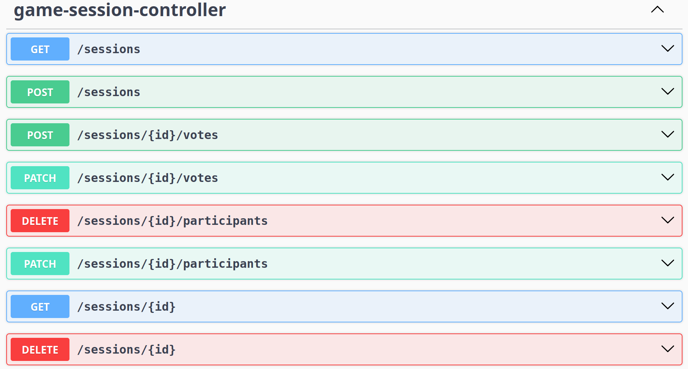
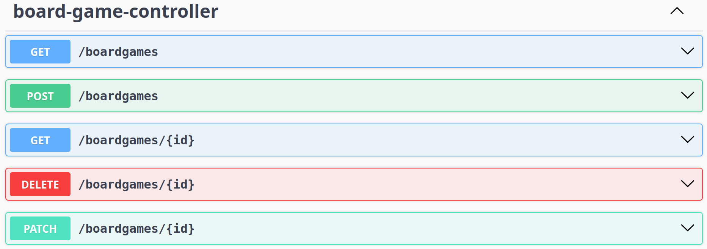
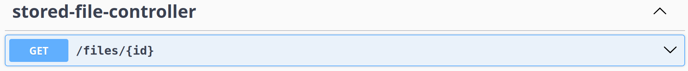

# Board Game Gather

Aplikacja służy do organizowania sesji gier planszowych. Umożliwia zarządzanie katalogiem gier, tworzenie sesji rozgrywek oraz dołączanie do nich przez innych użytkowników.

---

## Autorzy

- Maciej Kus
- Kamil Życzkowski
- Mariusz Krause

## Technologie
 - Backend: Java 25, Spring Boot
 - Frontend: React, Typescript
 - Komunikacja: REST API
 - Baza danych: POSTGRES

## Milestone 1
### Model bazodanowy


### Zrealizowane funkcjonalności
 - Rejestracja/logowanie użytkowników (login)
 - Listowanie gier planszowych z katalogu
 - Wyświetlanie szczegółów gry
 - Dodawanie nowych gier planszowych do katalogu
 - Listowanie istniejących sesji wraz ze szczegółami
 - Dołączanie do istniejącej sesji
 - Tworzenie nowych sesji z wybraną planszówką

### Endpointy


## Milestone 2

### Changelog
#### Główne zmiany
 - Migracja bazy z H2 na POSTGRES
 - Zmiana wysyłanego nagłówku login na "X-User-Login"
 - Poprawiona obsługa błędów, globalna obsługa błędów
 - Fix - błędy poprawnie wysyłają komunikaty w json
#### Planszówki
 - Planszówki posiadają zdjęcie i instrukcję
 - Można edytować pliki i opis planszówki po dodaniu
#### Sesje gry
 - Do sesji można dodać kilka planszówek
 - Każdy uczestnik sesji może głosować czy zna i czy chce zagrać w daną planszówkę
 - Uczestnik może opuścić sesję
 - Właściciel sesji może zakończyć głosowanie i wybrać planszówkę
 - Właściciel sesji może usunąć sesję gry
 
#### 

### Endpointy





## Uruchomienie projektu
### Backend
 W katalogu głównym projektu:
 ```
 cd ./backend
 ```
 Tworzymy plik `.env` na podstawie `.env.example`, z danymi do logowania do bazy danych. Następnie:
 ```
 sudo docker-compose up
 ```
 Uruchamiamy aplikację SpringBoot (np. przez IntelliJ IDEA), dodając plik `.env` jako zmienne środowiskowe, oraz profil `dev` w konfiguracji uruchomieniowej.
### Frontend
 W katalogu głównym projektu:
 ```
 cd ./frontend

 npm install

 npm run dev
 ```

 Strona jest dostępna pod adresem http://localhost:5173/
